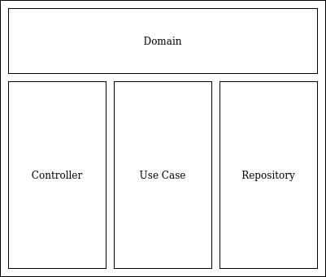

# Match making game

### Motivation

### Features
  
## Running the infrastructure

### Prerequisites
- Go 1.18 or above
- Docker

### Running with Docker
### Generate fake users

## How it works
### Overview

Clean architecture is a software design pattern popularized by Uncle Bob's that defines a system's responsibilities in a way that allows for a system to be changed without changing its implementation.

The main purpose of matchmaking services architecture is to separate business logic from infrastructure and try to apply best practices to clean architecture development.

### Parameters

## Contributing
